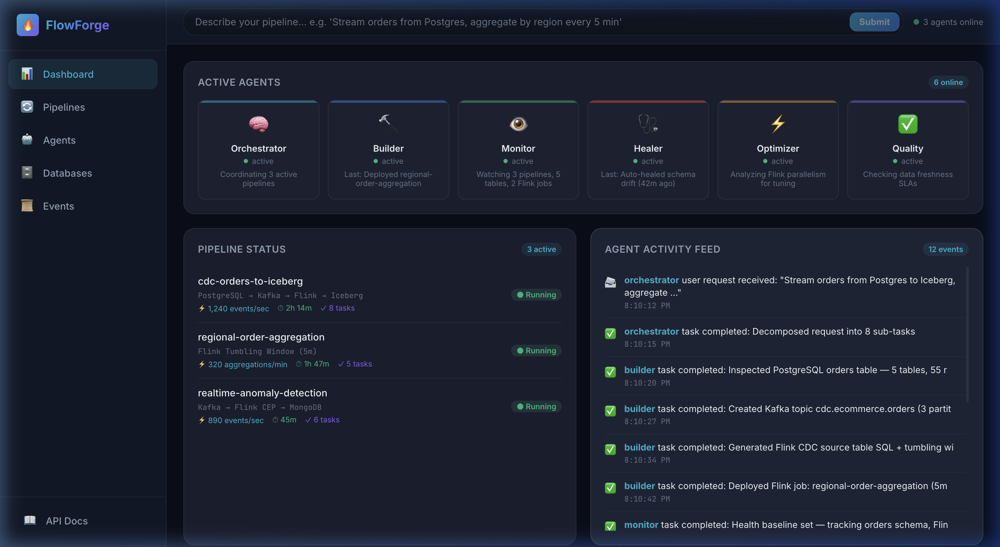
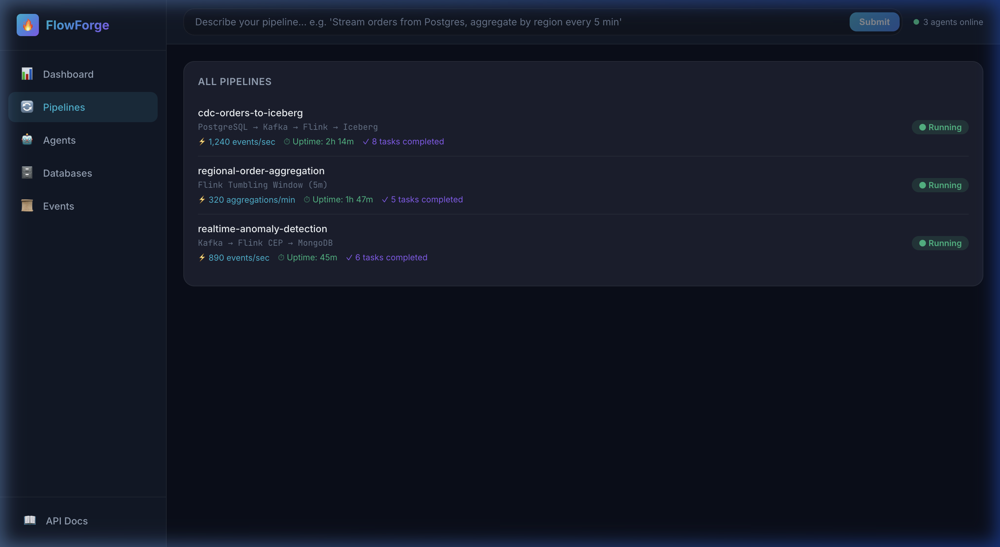
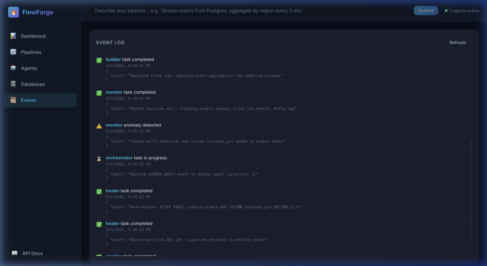
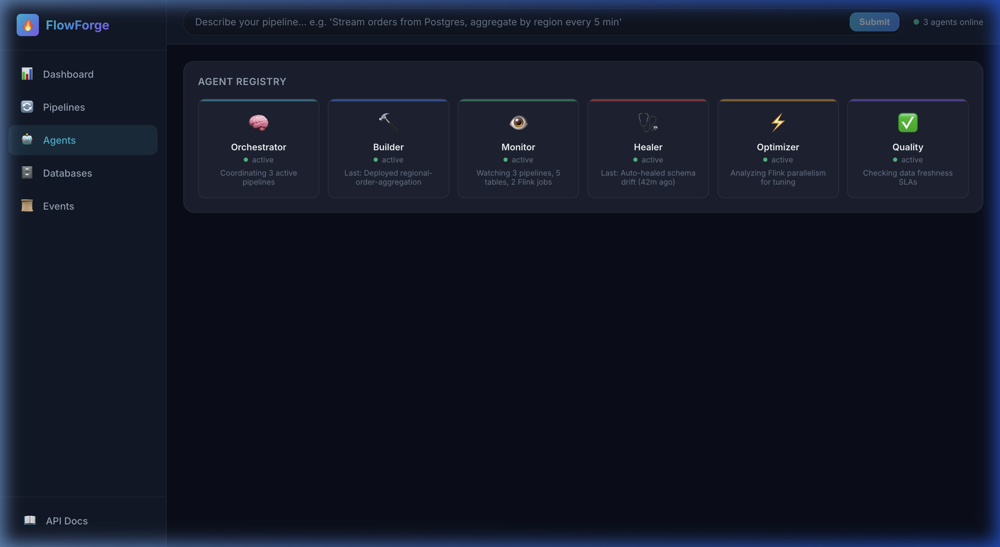
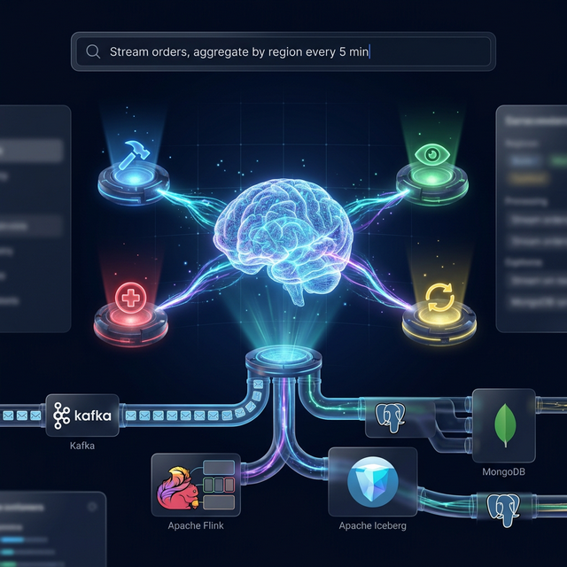
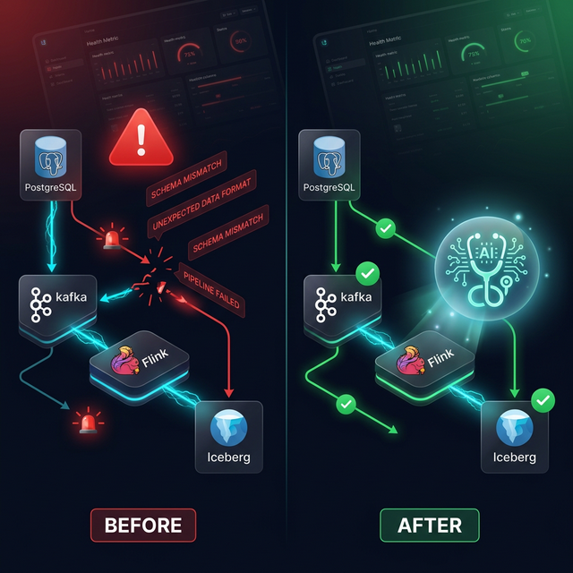

# 🔥 FlowForge — Multi-Agent AI Data Pipeline Platform

FlowForge is an end-to-end streaming data pipeline platform powered by **multiple AI agents** that collaborate to build, monitor, heal, and optimize your pipelines — all through **natural language**.

## ✨ Key Features

- **🧠 Multi-Agent Orchestration** — A team of specialized AI agents (Builder, Monitor, Healer, Optimizer, Quality) coordinated by a central Orchestrator
- **💬 Natural Language Interface** — Describe your pipeline in English: *"Stream orders from Postgres, aggregate by region every 5 min"*
- **🔌 MCP Servers** — Model Context Protocol servers for Kafka, Flink, Iceberg, PostgreSQL, and MongoDB
- **🩺 Self-Healing** — Automatic schema drift detection and resolution
- **📊 Premium Dashboard** — Real-time dark-mode UI for managing pipelines and watching agents work
- **📋 Skills & Workflows** — Reusable data engineering patterns (CDC, schema evolution, windowing)

## 📸 Dashboard & Screenshots

### Main Dashboard — Command Center


### All Pipelines — Live Metrics


### Event Log — Multi-Agent Collaboration


### Agent Registry


## 🏗️ Architecture



```
User (Natural Language) → Orchestrator Agent → Specialist Agents → MCP Servers → Infrastructure
                              │
                    ┌─────────┼─────────┐
                    ▼         ▼         ▼
              Builder    Monitor    Healer
              Agent      Agent      Agent
                │         │          │
                ▼         ▼          ▼
            Kafka MCP  Flink MCP  Iceberg MCP
                │         │          │
                ▼         ▼          ▼
             Kafka     Flink     Iceberg/MinIO
```

### Self-Healing Pipeline


## 🚀 Quick Start

### Prerequisites
- Docker Desktop (running)
- Python 3.11+
- Node.js 18+ (for dashboard)
- An LLM API key (OpenAI, Gemini, or Anthropic)

### 1. Setup Environment
```bash
# Clone and enter project
cd MCP

# Create .env from template
cp .env.example .env
# Edit .env and add your LLM_API_KEY

# Install Python dependencies
pip install -e .
```

### 2. Start Infrastructure
```bash
# Start all Docker services (Kafka, Flink, Iceberg, PostgreSQL, MongoDB, Redis)
docker compose up -d

# Verify services are running
docker compose ps
```

### 3. Use the CLI
```bash
# Check system health
python -m flowforge.cli health

# Send a natural language request
python -m flowforge.cli request "Stream orders from Postgres to Iceberg, aggregate by region"

# View agent activity
python -m flowforge.cli events

# List active agents
python -m flowforge.cli agents
```

### 4. Start the API Server
```bash
# Start the FastAPI backend
uvicorn flowforge.api_server:app --reload --port 8000
```

### 5. Start the Dashboard
```bash
# In a new terminal
cd dashboard
npm install
npm run dev
```

Open **http://localhost:5173** to see the FlowForge dashboard.

## 🤖 Agent Roles

| Agent | Role | What It Does |
|-------|------|-------------|
| 🧠 **Orchestrator** | Coordinator | Decomposes NL requests, delegates to specialists, synthesizes results |
| 🔨 **Builder** | Pipeline Creator | Creates Kafka topics, generates Flink SQL, deploys pipelines |
| 👁 **Monitor** | Health Watcher | Tracks throughput, detects anomalies, watches for schema drift |
| 🩺 **Healer** | Self-Healer | Diagnoses failures, auto-evolves schemas, restarts jobs |
| ⚡ **Optimizer** | Performance Tuner | Adjusts parallelism, partitioning, compaction (planned) |
| ✅ **Quality** | Data Validator | Validates completeness, freshness, accuracy (planned) |

## 📁 Project Structure

```
MCP/
├── docker-compose.yml          # Infrastructure (Kafka, Flink, Iceberg, PG, Mongo, Redis)
├── pyproject.toml              # Python project config
├── .env.example                # Environment template
│
├── flowforge/                  # Core Python package
│   ├── config.py               # Centralized configuration
│   ├── cli.py                  # CLI entry point (Typer + Rich)
│   ├── api_server.py           # FastAPI backend for dashboard
│   ├── data_generator.py       # E-commerce event generator
│   │
│   ├── servers/                # MCP Servers
│   │   ├── kafka_mcp.py        # Kafka topic mgmt, produce, consume
│   │   ├── flink_mcp.py        # Flink job mgmt via REST API
│   │   ├── postgres_mcp.py     # PostgreSQL query, schema, CDC
│   │   └── mongodb_mcp.py      # MongoDB query, aggregation
│   │
│   └── agents/                 # Multi-Agent System
│       ├── orchestrator.py     # Supervisory agent
│       ├── builder.py          # Pipeline builder specialist
│       ├── monitor.py          # Health monitoring specialist
│       ├── healer.py           # Self-healing specialist
│       └── shared/
│           ├── base.py         # Base agent class
│           ├── llm_client.py   # Multi-provider LLM abstraction
│           └── memory.py       # Redis-backed shared memory
│
├── skills/                     # Reusable Skills
│   ├── cdc-ingestion/          # Change Data Capture patterns
│   ├── schema-evolution/       # Schema drift detection & healing
│   └── window-aggregation/     # Flink SQL window patterns
│
├── .agents/workflows/          # Workflow Definitions
│   ├── multi-agent-deploy.md   # Multi-agent pipeline deployment
│   ├── multi-agent-incident.md # Multi-agent incident response
│   └── diagnose-pipeline.md    # Pipeline troubleshooting
│
├── data/init/                  # Database init scripts
│   ├── postgres/01_schema.sql  # E-commerce schema + sample data
│   └── mongodb/01_init.js      # Event collections + sample data
│
└── dashboard/                  # React + Vite frontend
    └── src/
        ├── App.jsx             # Main dashboard component
        └── index.css           # Design system
```

## 🔌 MCP Server Tools

### PostgreSQL MCP
- `query` — Execute SQL queries
- `list_tables` — List all tables with metadata
- `inspect_schema` — Full schema with PK/FK info
- `check_cdc_status` — Verify CDC readiness
- `get_sample_data` — Preview table contents

### Kafka MCP
- `list_topics` — List all topics
- `create_topic` / `delete_topic` — Topic management
- `produce_message` / `produce_batch` — Produce events
- `consume_messages` — Consume for inspection
- `get_topic_info` — Partition and replica details

### Flink MCP
- `cluster_overview` — Cluster health and slots
- `list_jobs` / `get_job_details` — Job management
- `get_job_exceptions` — Error diagnosis
- `submit_sql` — Submit Flink SQL statements
- `cancel_job` — Stop running jobs

### MongoDB MCP
- `list_collections` — Browse collections
- `find_documents` — Query with filters
- `aggregate` — Run aggregation pipelines
- `get_collection_schema` — Infer schema from samples
- `insert_document` / `create_collection` — Data management

## 🧪 Demo Scenarios

### 1. Deploy a Pipeline (Happy Path)
```bash
python -m flowforge.cli request "Stream orders from Postgres to Iceberg, aggregate by region every 5 minutes"
```

### 2. Simulate Schema Drift + Self-Heal
```bash
# First, start monitoring
python -m flowforge.cli request "Monitor all pipelines for schema drift"

# Then simulate drift (adds a column)
curl -X POST http://localhost:8000/api/simulate/schema-drift

# Watch the Healer agent auto-fix it
python -m flowforge.cli events
```

### 3. Generate Streaming Data
```bash
# Push events to Kafka
curl -X POST http://localhost:8000/api/generate-data -H 'Content-Type: application/json' -d '{"target":"kafka","count":100}'

# Insert orders into PostgreSQL
curl -X POST http://localhost:8000/api/generate-data -H 'Content-Type: application/json' -d '{"target":"postgres","count":20}'
```

## ⚙️ Configuration

All settings are configurable via environment variables or the `.env` file:

| Variable | Default | Description |
|----------|---------|-------------|
| `LLM_PROVIDER` | `openai` | LLM provider (openai/gemini/anthropic/ollama) |
| `LLM_MODEL` | `gpt-4o` | Model name |
| `LLM_API_KEY` | — | Your API key |
| `KAFKA_BOOTSTRAP_SERVERS` | `localhost:9092` | Kafka connection |
| `FLINK_JOBMANAGER_URL` | `http://localhost:8081` | Flink REST API |
| `POSTGRES_HOST` | `localhost` | PostgreSQL host |
| `REDIS_HOST` | `localhost` | Redis host |

## 📄 License

MIT